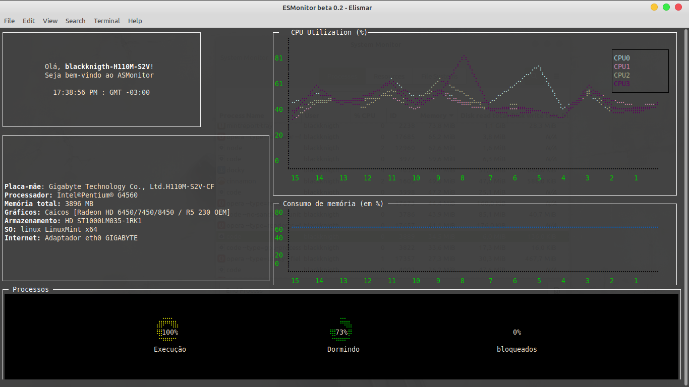

<h1 align="center">
    ASMonitor
</h1>

  

  
	
  

  

  
<a aria-label="In progress" href="">
  

  <a href="#-project">Project</a>&nbsp;&nbsp;&nbsp;|&nbsp;&nbsp;&nbsp;
  <a href="#rocket-Technologies">Technologies</a>&nbsp;&nbsp;&nbsp;|&nbsp;&nbsp;&nbsp;
  <a href="#-layout">Layout</a>&nbsp;&nbsp;&nbsp;|&nbsp;&nbsp;&nbsp;
  <a href="#-how-to-contribute">How to contribute</a>&nbsp;&nbsp;&nbsp;|&nbsp;&nbsp;&nbsp;
  <a href="#memo-license">License</a>

	

## 💻 Project

ASMonitor is a tool for shells that aims to show to user, in a simple and objective way, data of the hardware and the operational system.

## :rocket: Technologies

This project was developed with the following technologies:

- [Node.js](https://nodejs.org/en/) 
- [blessed](https://github.com/chjj/blessed#style)
- [blessed-contrib](https://github.com/yaronn/blessed-contrib)
- [System Informator](https://systeminformation.io/cpu.html)

## :wrench: How to use

1. First, you need [Node.js](https://nodejs.org/en/) version 12.16.0 or higher. 
2. Clone this repository in the terminal with this command:

	`git clone https://github.com/Elismar13/ASMonitor.git`

3. In the ASMonitor folder, runs this command:

	`npm update` 
	
	or, if you have yarn installed on your machine:
	
	`yarn`
	
4. Finally, runs this command:

	`node src/index.js`

## 🤔 How to contribute

- Make a fork;
- Create a branck with your feature: `git checkout -b my-feature`;
- Commit changes: `git commit -m 'feat: My new feature'`;
- Make a push to your branch: `git push origin my-feature`.

After merging your receipt request to done, you can delete a branch from yours.

## :memo: License

This project is under the MIT license. See the [LICENSE](LICENSE.md) for details.

---

Made with ♥ by Elismar Silva :wave: [Get in touch!](https://www.linkedin.com/in/elismar-silva-644272191/)
